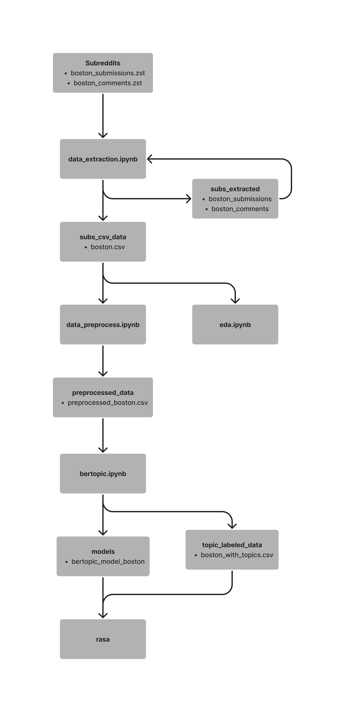
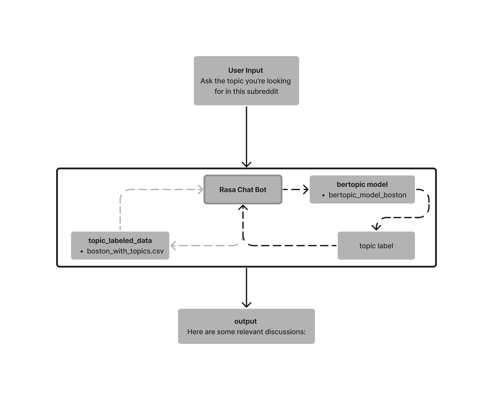

## Introduction
This project involves developing a chatbot using Rasa and the BERTopic model, designed to enhance user engagement with the r/Boston subreddit. It starts with sourcing a subreddit dataset, and involves several steps: extracting and structuring this data, preprocessing to clean and add contextual layers like season and time of day, and then applying the BERTopic model for in-depth topic analysis. The integration of these elements with a Rasa-based chatbot enables it to intelligently process user queries and deliver subreddit discussions that align closely with their interests, leveraging advanced NLP and machine learning techniques for a seamless user experience.

## subreddits

This directory contains comprehensive data for various subreddits. Specifically, our project focuses on the r/Boston subreddit. The dataset includes both comments and submissions, providing a detailed view of community interactions over an extended period.

### Data Source:
We've sourced our data from Academic Torrents, which offers an extensive collection of subreddit information ranging from June 2005 to December 2022. For more details and to access the full dataset, visit [Academic Torrents - r/Boston Data](https://academictorrents.com/details/c398a571976c78d346c325bd75c47b82edf6124e).

### Included Files:
- **boston_submissions.zst:** Contains the posts made to the subreddit.
- **boston_comments.zst:** Includes the comments from the subreddit's posts.

You can find this directory at this Google Drive link: [r/Boston_Subreddit_Data_Model Files](https://drive.google.com/drive/folders/13_sqAMAzqzR7QrDTnGGyQ03VKDi-CSe9?usp=share_link).

## data_extraction.ipynb

The `data_extraction.ipynb` notebook is designed to extract and process `.zst` files into readable, structured formats. It specifically targets data from the r/Boston subreddit, converting raw archives into text files in JSON format, then into a combined CSV file.

 **Extraction:** The notebook begins by decompressing the `.zst` files from the ‘subreddits’ directory (boston_submissions and boston_comments) into the `data_extracted` directory.
 **Conversion:** These JSON formatted text files are then converted into a single CSV file.
 **Filtering:** Data is filtered to include posts from December 2019 to December 2022. Only text data is retained for analysis.

- **CSV File:** The final output is a CSV file named `boston.csv` located in the `subs_csv_data` directory. This file contains structured data from the r/Boston subreddit within the specified date range, focusing on text-based posts and comments.

You can find the `data_extracted` and `subs_csv_data` directories at this Google Drive link: [r/Boston_Subreddit_Data_Model Files](https://drive.google.com/drive/folders/13_sqAMAzqzR7QrDTnGGyQ03VKDi-CSe9?usp=share_link).

## data_preprocess.ipynb

The `data_preprocess.ipynb` notebook is designed to clean and prepare data from the `boston.csv` file, which is generated by `data_extraction.ipynb`. The output, `preprocessed_boston.csv`, is saved in the `preprocessed_data` directory. This notebook outlines the preprocessing steps applied to the dataset.

### Process Steps:

**Season and Time of Day:** Adds new columns to classify each post by the season and part of the day it was created.
 **Comments Counting:** Counts the number of comments for each post.
 **Text Cleaning:** Implements a series of cleaning steps to:
   - Fill missing values with spaces.
   - Remove unwanted patterns such as '[removed]', '[deleted]', and ‘[deleted by user]’ as well as bot messages.
   - Convert emojis to text and remove remaining emojis and special characters.
   - Clean and standardize the text by removing URLs, mentions, hashtags, HTML entities, and extra whitespace.

### Final Output:

- **CSV File:** The cleaned and preprocessed data is saved as `preprocessed_boston.csv` in the `preprocessed_data` directory.

You can find this file at this Google Drive link: [r/Boston_Subreddit_Data_Model Files](https://drive.google.com/drive/folders/13_sqAMAzqzR7QrDTnGGyQ03VKDi-CSe9?usp=share_link).

## bertopic.ipynb

The `bertopic.ipynb` notebook is designed to analyze and label the preprocessed text data from `preprocessed_boston.csv` using the BERTopic model. It creates a topic model to understand the underlying themes in the r/Boston subreddit posts and saves the outputs for further analysis and visualization.

### Process Steps:

 **Embeddings Calculation:** Calculates embeddings for the text using the SentenceTransformer model, specifically "all-MiniLM-L6-v2", and saves the embeddings_boston.npy file in the ‘embeddings’ directory.
 **BERTopic Modeling:** Initializes and fits a BERTopic model to the text data, capturing the key topics and their distributions within the dataset.
**Model Saving:** Saves the BERTopic model to the `models` directory as `bertopic_model_submissions_boston`.
 **Topic Labeling:** Assigns labels to each topic using KeyBERT-inspired representations and updates the original DataFrame with these labels.
 **Data Export:** Saves the enhanced DataFrame with topic information to `boston_with_topics.csv` in the `topic_labeled_data` directory.

### Key Outputs:

- **Embeddings File:** `embeddings/embeddings_boston.npy` - Stores the pre-calculated text embeddings.
- **BERTopic Model File:** `models/bertopic_model_submissions_boston` - Contains the trained BERTopic model.
- **Enhanced DataFrame:** `topic_labeled_data/boston_with_topics.csv` - The preprocessed data with added columns for topic labels, topic names, and KeyBERT representations.

You can find these files at this Google Drive link: [r/Boston_Subreddit_Data_Model Files](https://drive.google.com/drive/folders/13_sqAMAzqzR7QrDTnGGyQ03VKDi-CSe9?usp=share_link).

### Visualizations:

- **Topic Frequencies:** Visualizes the frequency of each topic, highlighting the most prevalent themes in the data.
- **Hierarchical Topic Reduction:** Provides a way to view and understand the hierarchical structure of the topics.
- **Topic Representation:** Shows a visual representation of the topics and their relative importance.

## rasa.ipynb

The `rasa.ipynb` file is a Jupyter notebook used to train a Rasa model.

**Output**:
- The output of this process is a trained Rasa model. It is saved in the specified `rasa` directory. The model will be in a subdirectory named after the current date and time, containing all the necessary files to run the Rasa chatbot.

The flowchart represents how a Rasa chatbot utilizes a BERTopic model to process user input and provide relevant discussion topics from a subreddit.

Here's how the process works in line with the files in the Rasa directory:

**User Input**: A user asks the chatbot about a specific topic they're interested in within the subreddit.

 **Rasa Chat Bot**: The chatbot, powered by Rasa, receives this input. It uses its trained models to understand the user's intent and extract relevant entities (like the topic of interest).

   - **nlu.yml**: Contains training data for the NLU model to understand user intents and entities.
   - **stories.yml**: Provides examples of interaction flows, teaching the chatbot how to respond to different sequences of user input.
   - **domain.yml**: Defines the actions the chatbot can take, including custom actions like `action_find_discussion`.
   - **actions.py**: Contains the code for the custom action that processes the user input, interacts with the BERTopic model, and fetches relevant discussions.
   - **config.yml**: Specifies the language and machine learning pipeline that Rasa uses to interpret user messages.
   - **endpoints.yml**: Used to specify how the Rasa server communicates with action servers for executing custom actions.

**BERTopic Model**: The custom action utilizes the BERTopic model to determine the most relevant topic label for the user's input.

   - **bertopic_model_boston**: The trained BERTopic model that can assign topic labels to text based on their content.

 **Topic Labeled Data**: The chatbot then uses this topic label to query a CSV file containing subreddit discussions that have been previously labeled with topics.

   - **boston_with_topics.csv**: This CSV file contains subreddit data with discussions already associated with specific topics (the output from the `bertopic.ipynb` notebook).

 **Output**: Finally, the chatbot responds to the user with a message listing relevant discussions based on the topic label provided by the BERTopic model.

To run the Rasa chatbot and utilize the BERTopic model for processing user input, follow these steps:

1. **Start the Action Server**:
   - Open a terminal window.
   - Navigate to your Rasa project directory: `cd path_to_your_rasa_folder`.
   - Run the command: `rasa run actions`.
   - This starts the action server, which allows Rasa to execute custom actions defined in `actions.py`.

2. **Run Rasa Shell**:
   - Open another terminal window.
   - Navigate to the same Rasa project directory if not already there.
   - Run the chatbot with the specific model and endpoints configuration: `rasa shell --model 20231221-195102-formal-play.tar.gz --endpoints endpoints.yml`.

3. **Check for Port Availability**:
   - Before running the Rasa shell, ensure that the required port (usually 5055 for Rasa action server) is free.
   - In the terminal, you can check if the port is in use with `lsof -i :5055`.
   - If the port is occupied and you need to free it up, use `kill -9 PID`, where PID is the Process ID using the port, which you can find from the output of the `lsof` command.

4. **Interacting with the Chatbot**:
   - Once the Rasa shell starts successfully, you can begin typing user inputs directly into the terminal.
   - The chatbot will process these inputs using the flow outlined previously, providing relevant subreddit discussion topics.
